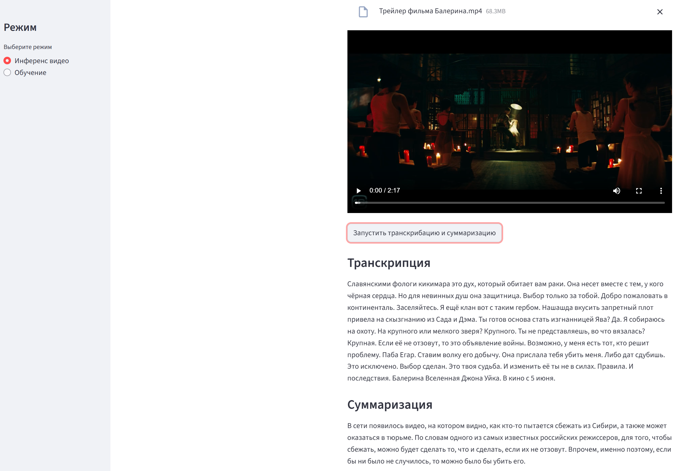

# Whisper Video Summarization

Проект для автоматической суммаризации видео с использованием моделей Whisper и T5. Система транскрибирует видеофайлы с помощью Whisper и создает краткие резюме транскрипций с помощью модели T5.

## Описание проекта

Проект представляет собой MLOps-решение для суммаризации видео, которое объединяет:

- **Whisper** - модель от OpenAI для транскрипции аудио и видео в текст
- **T5** - модель для генерации суммаризаций текста на русском языке
- **FastAPI** - REST API для взаимодействия с моделью
- **Streamlit** - веб-интерфейс для загрузки видео и обучения модели
- **MLflow** - отслеживание экспериментов и метрик обучения
- **DVC** - управление версиями данных и моделей
- **Hydra** - управление конфигурациями

### Основные возможности

1. **Транскрипция видео**: Преобразование видеофайлов в текст с помощью Whisper
2. **Суммаризация текста**: Создание кратких резюме из транскрипций с помощью T5
3. **Обучение модели**: Fine-tuning модели T5 на датасете Gazeta
4. **Отслеживание экспериментов**: Логирование метрик и параметров через MLflow
5. **Веб-интерфейс**: Удобный интерфейс для работы с системой через Streamlit

## Технические детали

### Setup

Проект использует Docker Compose для управления окружением. Для настройки выполните следующие шаги:

#### Требования

- Docker
- Docker Compose

#### Шаги установки

1. **Клонирование репозитория**

```bash
git clone <repository-url>
cd whisper_video_summarization
```

2. **Сборка Docker образов**

```bash
docker-compose build
```

Это создаст три образа:

- `fastapi` - сервис с FastAPI и зависимостями для инференса
- `mlflow` - сервис для отслеживания экспериментов
- `streamlit` - веб-интерфейс

3. **Запуск всех сервисов**

```bash
docker-compose up
```

После запуска сервисы будут доступны по следующим адресам:

- **FastAPI**: http://localhost:8000
- **FastAPI Docs**: http://localhost:8000/docs
- **MLflow**: http://localhost:8080
- **Streamlit**: http://localhost:8501

### Train

Для обучения модели суммаризации выполните следующие шаги:

#### 1. Подготовка данных

В проекте уже есть тестовый датасет для обучения: `data/test_train.jsonl`. Датасет содержит данные в формате JSONL, где каждая строка представляет собой JSON объект с полями `text` (текст статьи) и `summary` (краткое резюме).

Пример структуры:

```json
{"text": "Длинный текст статьи...", "summary": "Краткое резюме..."}
{"text": "Другой текст...", "summary": "Другое резюме..."}
```

#### 2. Запуск обучения

**Через Streamlit интерфейс:**

**Ожидается успешный запуск обучения и снижение loss в процессе обучения.**

#### 3. Параметры обучения

Параметры обучения настраиваются через конфигурационные файлы в директории `configs/`:

- `configs/train.yaml` - основные параметры обучения (batch_size, epochs, seed)
- `configs/model/t5.yaml` - параметры модели (название модели, learning rate)
- `configs/data/gazeta.yaml` - параметры данных (max_length)
- `configs/paths/paths.yaml` - пути к данным и моделям

#### 4. Результаты обучения

После завершения обучения модель сохраняется в:

```
whisper_video_summarization/models/summarizer/checkpoints/best.ckpt
```

Эта модель используется для инференса. При использовании Docker данные сохраняются в volume, поэтому модель будет доступна после перезапуска контейнеров.

### Использование обученной модели

**Эндпоинты FastAPI:**

- `POST /infer` - суммаризация текста
- `POST /infer/video` - транскрипция и суммаризация видео
- `POST /train` - запуск обучения (фоновый режим)

### Структура проекта

```
whisper_video_summarization/
├── configs/              # Конфигурационные файлы Hydra
│   ├── train.yaml
│   ├── model/
│   ├── data/
│   ├── logging/
│   └── paths/
├── whisper_video_summarization/
│   ├── api/              # FastAPI приложение
│   ├── data/             # Датасеты и их обработка
│   ├── models/           # Модели (Whisper, T5)
│   ├── training/         # Скрипты обучения
│   ├── whisper/          # Модуль транскрипции
│   ├── streamlit/        # Streamlit интерфейс
│   └── utils/            # Утилиты
├── data/                 # Данные проекта
├── dvc.yaml              # DVC pipeline
├── pyproject.toml        # Poetry конфигурация
└── README.md
```

### Требования

- Docker
- Docker Compose

### Работа с данными в Docker

При использовании Docker Compose данные и модели монтируются как volumes, поэтому изменения сохраняются между перезапусками:

- `./data` - данные проекта (включая `test_train.jsonl`)
- `./whisper_video_summarization/models` - модели
- `./configs` - конфигурационные файлы
- `./mlflow.db` - база данных MLflow
- `./mlruns` - артефакты MLflow
- `./tmp` - временные файлы (видео для обработки)

## Пример работы приложения


